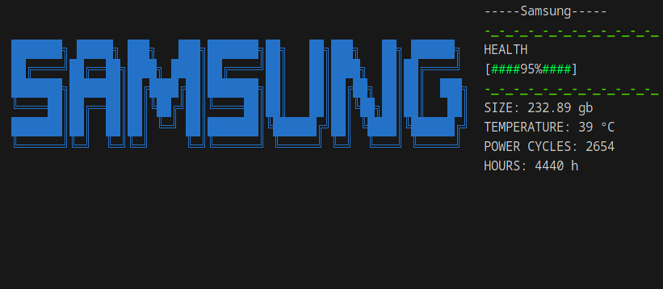

<h1 align="left">diskfetch</h1>

###

###

<h4 align="left">diskfetch - it's like neofetch, but for your disks. Diskfetch is terminal user interfase util for linux, for get more info of your disks.</h4>

###

<h2 align="left">dependencies</h2>

###

* libnvme * libatasmart * sudo

###
